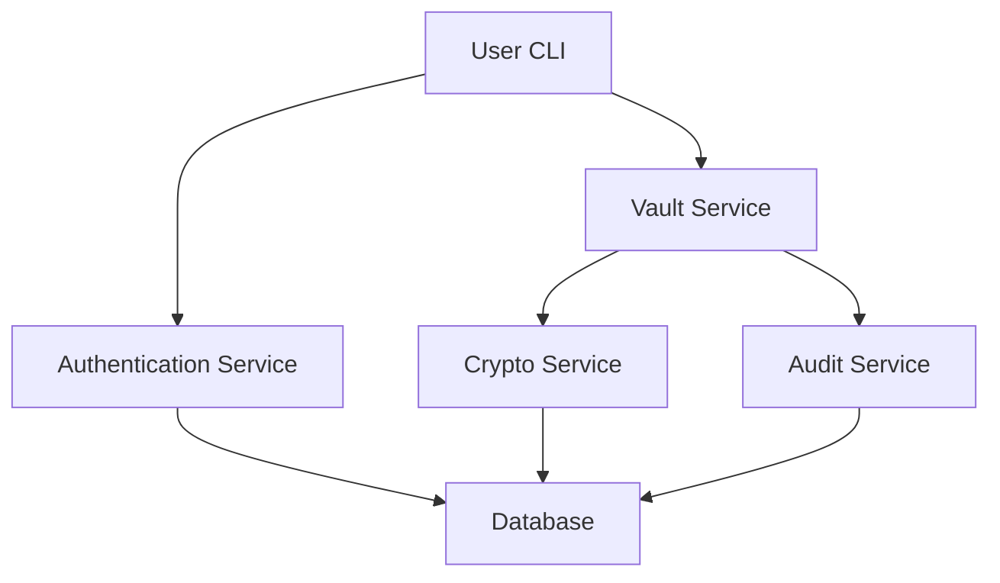

# Secure Password Vault - Privacy-First, CLI-Based Secret Management

[](https://opensource.org/licenses/MIT)
[](https://adoptium.net/)
[](https://spring.io/projects/spring-boot)

## Overview

The **Secure Password Vault** is a production-grade, CLI-based application designed for secure secret management. It emphasizes a "security-first" architecture, featuring robust encryption, enforced multi-factor authentication (MFA), role-based access control (RBAC), and tamper-evident audit logging.

Unlike typical password managers, this vault is designed with zero-trust principles in mind—even database administrators cannot read the stored secrets without the user's master password and TOTP token.

## Architecture

The system is built on a modular architecture to ensure separation of concerns and maintainability:



-   **Core Crypto**: Centralized cryptographic primitives (AES-GCM, Argon2id).
-   **Authentication**: Handles user identity, session management, and TOTP.
-   **Vault Management**: Secure storage and retrieval of secrets.
-   **Audit Service**: ensures accountability via hash-chained logs.

## Security Features

### 1. Cryptography
-   **Password Hashing**: [Argon2id](https://en.wikipedia.org/wiki/Argon2) (memory-hard, resistant to GPU/ASIC attacks).
    -   *Params*: 64MB memory, 4 iterations, 2 parallelism.
-   **Encryption**: AES-256-GCM (Galois/Counter Mode).
    -   Provides Authenticated Encryption (Confidentiality + Integrity).
    -   Unique 12-byte IV generated for *every* encryption operation.
    -   No padding oracle vulnerabilities (unlike CBC mode).
-   **Randomness**: All keys and IVs generated using `java.security.SecureRandom`.

### 2. Multi-Factor Authentication (MFA)
-   **TOTP**: Time-based One-Time Password (RFC 6238).
-   **Enforcement**: Mandatory for all users.
-   **Security**: TOTP secrets are encrypted at rest using a master key.
-   **Rate Limiting**: Accounts are locked for 15 minutes after 5 failed login attempts.

### 3. Role-Based Access Control (RBAC)
-   **ADMIN**: Full access to all vault entries (can view/edit/delete any record).
-   **USER**: standard access (can view/edit/delete *own* entries).
-   **READ_ONLY**: Limited access (can view own entries, cannot modify).
-   *Enforcement location*: Service layer (server-side), never trusted to the client.

### 4. Tamper-Evident Audit Logging
-   Every security-critical action is logged (Login, Access Denied, Decryption).
-   **Hash Chaining**: Each log entry contains a SHA-256 hash of the previous log entry + current data.
    -   `Hash(n) = SHA256(Hash(n-1) + Data(n))`
    -   This creates a blockchain-like structure. Modification of any past log invalidates the entire subsequent chain.

## Prerequisites

-   **Java 17** or higher
-   **PostgreSQL 12** or higher
-   **Maven 3.6** or higher

## Setup Guide

### 1. Database Setup

**Option A: Docker (Recommended)**
```bash
docker run --name password-vault-db \
  -e POSTGRES_PASSWORD=postgres \
  -e POSTGRES_DB=password_vault \
  -p 5432:5432 \
  -d postgres:15
```

**Option B: Local Installation**
Ensure PostgreSQL is running and create the database:
```sql
CREATE DATABASE password_vault;
```

### 2. Configuration

Environment variables can be used to override defaults in `application.yml`:

| Variable | Default | Description |
| :--- | :--- | :--- |
| `DB_USERNAME` | `postgres` | Database username |
| `DB_PASSWORD` | `postgres` | Database password |
| `DB_URL` | `jdbc:postgresql://localhost:5432/password_vault` | JDBC Connection URL |

### 3. Build

```bash
mvn clean install
```

### 4. Run

```bash
mvn spring-boot:run
```

## CLI Usage

### Initial Registration
When you first run the application, register a new user:

```text
> register
Username: admin
Password: [hidden]
Confirm Password: [hidden]
Role (ADMIN/USER/READ_ONLY) [default: USER]: ADMIN

✓ Registration successful
=== MFA Setup ===
Scan this QR code with your authenticator app:
[QR Code URL]
Or manually enter this secret: JBSWY3DPEHPK3PXP
```

### Login
```text
> login
Username: admin
Password: [hidden]
TOTP Code: 123456

✓ Login successful
Welcome, admin (ADMIN)
```

### Vault Operations
-   **Add Entry**: `add`
-   **List Entries**: `list`
-   **View Entry**: `view` (prompts for ID)
-   **Edit Entry**: `edit` (prompts for ID)
-   **Delete Entry**: `delete` (prompts for ID)
-   **Logout**: `logout`

## Versioning

This project follows [Semantic Versioning](https://semver.org/) (v1.0.0).

## Future Roadmap

-   [ ] **v1.1**: Encrypted Backup & Restore (JSON export).
-   [ ] **v1.2**: Password Strength Analyzer.
-   [ ] **v2.0**: REST API exposing endpoints for web/mobile clients.
-   [ ] **v2.1**: Hardware Security Module (HSM) integration for master key storage.

---
**Disclaimer**: This tool is provided for educational and secure secret management purposes. Ensure you back up your database regularly.
